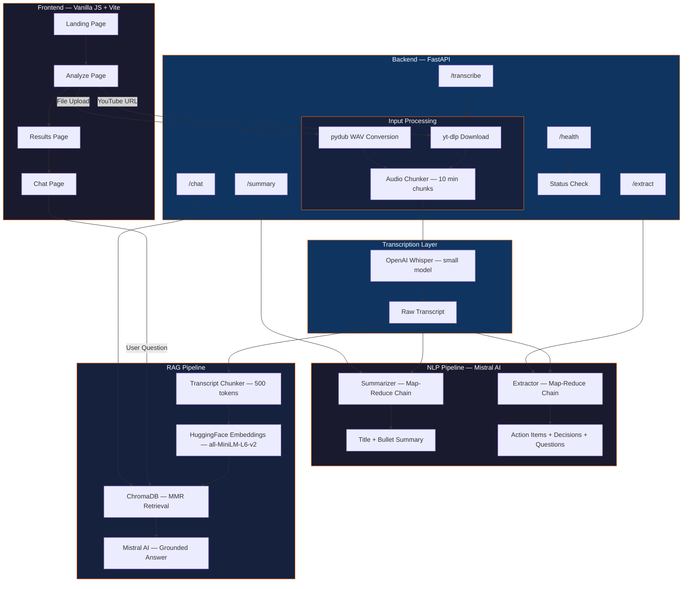
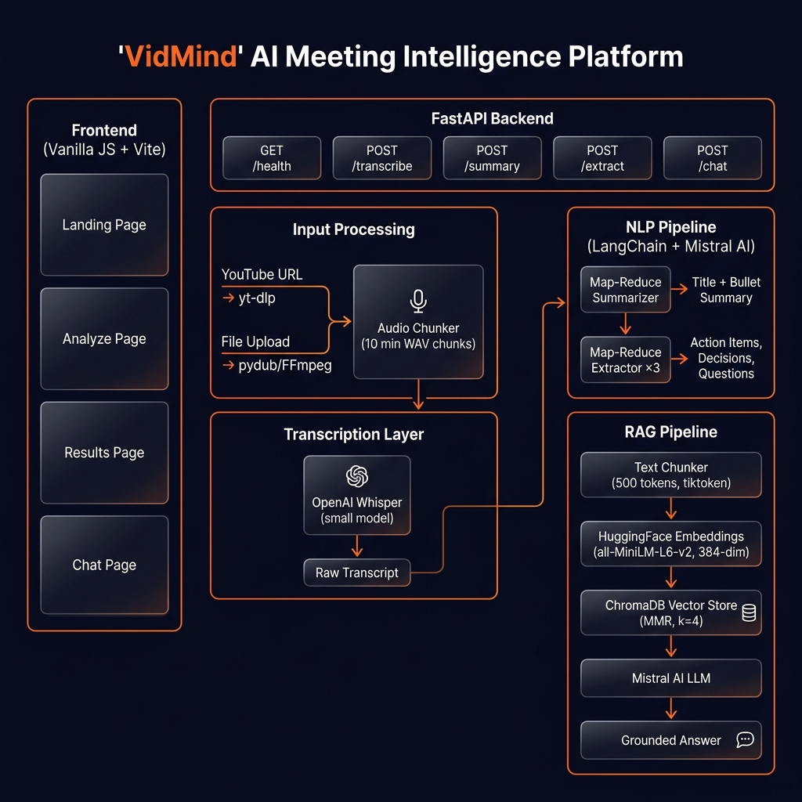

<div align="center">

# 🧠 VidMind

**End-to-end AI Meeting Intelligence Platform — Transcribe, Summarize, Extract Insights, and Chat with Video Content using RAG**

[](https://python.org)
[](https://fastapi.tiangolo.com)
[](https://mistral.ai)
[](https://langchain.com)
[](https://docker.com)

[Features](#-features) · [Architecture](#-architecture) · [Tech Stack](#-tech-stack) · [Setup](#-setup--installation) · [API Reference](#-api-reference) · [Demo](#-demo)

</div>

---

## 📌 Problem Statement

Meetings generate hours of unstructured audio and video content that is difficult to review, search, or act upon. Professionals waste time manually rewatching recordings, taking notes, and tracking action items. There is no efficient way to extract structured intelligence from meeting recordings or to ask ad-hoc questions about past discussions without replaying the entire recording.

---

## 💡 Solution Overview

**VidMind** is a full-stack AI-powered meeting intelligence platform that automates the entire workflow from raw audio/video to actionable insights. It accepts YouTube URLs or local audio/video file uploads, transcribes them using OpenAI Whisper, then leverages Mistral AI's LLM through LangChain to generate structured summaries, extract action items, decisions, and open questions, and enables conversational Q&A over the transcript using a Retrieval-Augmented Generation (RAG) pipeline backed by ChromaDB.

The system implements a **Map-Reduce** chain architecture for summarization and extraction to handle long transcripts, a **custom hash-based SPA router** with glassmorphism UI for the frontend, and a **modular service-oriented backend** with FastAPI.

---

## 🏗 Architecture

### System Flow

1. **Input**: User provides a YouTube URL or uploads an audio/video file via the frontend
2. **Audio Processing**: `AudioProcessor` downloads (via yt-dlp) or converts (via pydub/ffmpeg) the source to mono 16kHz WAV, then splits into 10-minute chunks
3. **Transcription**: OpenAI Whisper (`small` model) transcribes each chunk; supports translation to English
4. **Auto-Ingestion**: Transcript is automatically chunked (500 tokens, 50 overlap) and embedded into ChromaDB via `all-MiniLM-L6-v2`
5. **Summarization**: Mistral AI Map-Reduce chain generates a bullet-point summary and title
6. **Extraction**: Parallel Map-Reduce chains extract action items (with owners/deadlines), decisions, and open questions
7. **RAG Chat**: User asks natural-language questions; MMR retrieval (k=4, fetch_k=20) fetches relevant context; Mistral AI generates grounded answers





---

## ⚙️ Tech Stack

| Layer | Technology | Purpose |
|:------|:-----------|:--------|
| **Backend Framework** | FastAPI `>=0.115.0` | Async REST API with automatic OpenAPI docs |
| **ASGI Server** | Uvicorn `>=0.30.0` | High-performance ASGI server |
| **LLM Provider** | Mistral AI (`mistral-small-latest`) | Summarization, extraction, and RAG answer generation |
| **LLM Orchestration** | LangChain `>=0.2.0` | Chain composition, prompt templates, output parsing |
| **Transcription** | OpenAI Whisper (`small` model) | Local speech-to-text, supports transcription + translation |
| **Embedding Model** | `sentence-transformers/all-MiniLM-L6-v2` | 384-dimensional semantic embeddings for RAG |
| **Vector Store** | ChromaDB `>=0.5.0` | Persistent vector storage with MMR retrieval |
| **Audio Processing** | yt-dlp + pydub + FFmpeg | YouTube download, format conversion, audio chunking |
| **Frontend** | Vanilla JavaScript (ES Modules) | Custom SPA with hash-based routing |
| **Frontend Bundler** | Vite `>=6.3.5` | Dev server with API proxy, hot module reload |
| **Validation** | Pydantic `>=2.7.0` | Request/response schema validation |
| **Configuration** | pydantic-settings `>=2.3.0` | Type-safe environment variable loading |
| **Containerization** | Docker (`python:3.11-slim`) | Production-ready containerized deployment |
| **Logging** | Python `logging` | Timestamped file + stdout dual logging |

---

## 🔬 NLP / RAG Pipeline

### Models Used

| Component | Provider | Model | Type | Dimensions | Temperature |
|:----------|:---------|:------|:-----|:-----------|:------------|
| LLM (Summarization) | Mistral AI | `mistral-small-latest` | Chat Completion | — | 0.3 |
| LLM (Extraction) | Mistral AI | `mistral-small-latest` | Chat Completion | — | 0.2 |
| LLM (RAG Q&A) | Mistral AI | `mistral-small-latest` | Chat Completion | — | 0.3 |
| Embeddings | HuggingFace | `all-MiniLM-L6-v2` | Sentence Transformer | 384 | — |
| Transcription | OpenAI (Local) | Whisper `small` | Speech-to-Text | — | — |

### Step-by-Step Inference Pipeline

```
┌─────────────────────────────────────────────────────────────────────────┐
│                        INGESTION PIPELINE                               │
├─────────────────────────────────────────────────────────────────────────┤
│                                                                         │
│  1. Source Detection                                                    │
│     └─ YouTube URL → yt-dlp download (bestaudio → WAV @ 192kbps)       │
│     └─ File Upload → pydub conversion (mono, 16kHz WAV)                │
│                                                                         │
│  2. Audio Chunking                                                      │
│     └─ Split WAV into 10-minute chunks via pydub                        │
│                                                                         │
│  3. Transcription                                                       │
│     └─ Whisper small model (CPU/CUDA auto-select)                       │
│     └─ Task: "transcribe" or "translate" (for non-English → English)    │
│     └─ fp16=False for CPU compatibility                                 │
│     └─ Concatenate chunk texts → full transcript                        │
│                                                                         │
│  4. Vector Store Ingestion (Auto)                                       │
│     └─ Reset existing ChromaDB collection                               │
│     └─ RecursiveCharacterTextSplitter (tiktoken, 500 tokens, 50 overlap)│
│     └─ Embed via all-MiniLM-L6-v2 (384-dim)                            │
│     └─ Store in ChromaDB (collection: "transcript_embeddings")          │
│                                                                         │
├─────────────────────────────────────────────────────────────────────────┤
│                     ANALYSIS PIPELINE                                   │
├─────────────────────────────────────────────────────────────────────────┤
│                                                                         │
│  5. Summarization (Map-Reduce)                                          │
│     └─ Split transcript (tiktoken, 2000 tokens, 200 overlap)            │
│     └─ MAP: Summarize each chunk independently via Mistral AI           │
│     └─ REDUCE: Combine partial summaries → final bullet-point summary   │
│     └─ Generate concise title from final summary                        │
│                                                                         │
│  6. Extraction (Map-Reduce × 3)                                         │
│     └─ Split transcript (tiktoken, 2000 tokens, 200 overlap)            │
│     └─ Three parallel extractions:                                      │
│        ├─ Action Items (with owner + deadline)                          │
│        ├─ Decisions Made                                                │
│        └─ Open Questions / Follow-ups                                   │
│     └─ Each uses MAP → REDUCE with deduplication + merging              │
│                                                                         │
├─────────────────────────────────────────────────────────────────────────┤
│                        RAG QUERY PIPELINE                               │
├─────────────────────────────────────────────────────────────────────────┤
│                                                                         │
│  7. Question Answering                                                  │
│     └─ User question → ChromaDB MMR retriever (k=4, fetch_k=20)        │
│     └─ Retrieved context formatted with "\n\n" separator               │
│     └─ System prompt: "Answer ONLY from transcript context"             │
│     └─ Mistral AI generates grounded answer                             │
│     └─ Falls back: "I could not find this information in the transcript"│
│                                                                         │
└─────────────────────────────────────────────────────────────────────────┘
```

---

## ✨ Features

- **🎥 YouTube URL Transcription** — Paste any YouTube link; yt-dlp extracts audio, Whisper transcribes it
- **📁 Local File Upload** — Drag-and-drop or browse for MP4, MP3, WAV, WebM files
- **🌍 Translation Mode** — Whisper translates non-English audio to English in real-time
- **📝 AI Summarization** — Map-Reduce chain generates bullet-point summaries with auto-generated titles
- **✅ Action Item Extraction** — Extracts tasks with assigned owners and deadlines
- **📋 Decision Extraction** — Identifies and lists all decisions made during the meeting
- **❓ Open Question Extraction** — Surfaces unresolved questions and follow-up items
- **💬 RAG-Powered Chat** — Ask natural-language questions about the transcript with context-grounded answers
- **🎨 Glassmorphism UI** — Dark theme with neon orange accents, particle canvas, mouse glow effects
- **⚡ SPA Navigation** — Custom hash-based router with smooth page transitions
- **📊 Processing Pipeline Visualization** — Real-time step indicators and waveform visualizer during analysis
- **📋 Copy to Clipboard** — One-click copy for all extracted content
- **🔄 Auto-Ingestion** — Transcript automatically embedded into ChromaDB after transcription
- **📄 Markdown Rendering** — AI responses rendered as formatted markdown via Marked.js
- **📡 Health Check Endpoint** — Backend status monitoring

---

## 📡 API Reference

### `GET /health`

Health check endpoint.

**Response:**

```json
{
  "status": "ok"
}
```

---

### `POST /transcribe`

Transcribe audio from a YouTube URL or uploaded file. Accepts **multipart form data**.

**Request (Form Data):**

| Field | Type | Required | Description |
|:------|:-----|:---------|:------------|
| `file` | `UploadFile` | One of `file` or `youtube_url` | Local audio/video file |
| `youtube_url` | `string` | One of `file` or `youtube_url` | YouTube video URL |
| `translate` | `boolean` | No (default: `false`) | Translate non-English audio to English |

**Response:**

```json
{
  "transcript": "Welcome to today's meeting. We'll be discussing the Q3 roadmap...",
  "num_chunks": 2,
  "source_type": "youtube_url"
}
```

**Error Responses:**

| Status | Condition |
|:-------|:----------|
| `422` | Both `file` and `youtube_url` provided, or neither provided |
| `404` | Local file path not found |
| `500` | Transcription failure |

---

### `POST /summary`

Generate a title and bullet-point summary from a transcript.

**Request (JSON):**

```json
{
  "transcript": "Full transcript text to summarize..."
}
```

**Response:**

```json
{
  "title": "Q3 Product Roadmap Alignment Meeting",
  "summary": "- The team discussed the Q3 product roadmap priorities...\n- Engineering capacity was reviewed..."
}
```

---

### `POST /extract`

Extract action items, decisions, and open questions from a transcript.

**Request (JSON):**

```json
{
  "transcript": "Full transcript text to extract from..."
}
```

**Response:**

```json
{
  "action_items": "1. John to finalize the API design document by Friday\n2. Sarah to schedule user testing sessions...",
  "decisions": "1. The team decided to use PostgreSQL over MongoDB for the new service...",
  "questions": "1. What is the timeline for the infrastructure migration?\n2. Who will lead the security audit?"
}
```

---

### `POST /chat`

Ask a natural-language question over the ingested transcript via the RAG pipeline.

**Request (JSON):**

```json
{
  "question": "What were the main decisions made about the database?"
}
```

**Response:**

```json
{
  "answer": "Based on the transcript, the team decided to use PostgreSQL over MongoDB for the new service due to the need for complex relational queries..."
}
```

**Error Responses:**

| Status | Condition |
|:-------|:----------|
| `500` | RAG query failure or no transcript ingested |

---

## 📊 Evaluation Metrics

| Metric | Value | Notes |
|:-------|:------|:------|
| Transcription Model | Whisper `small` | ~461M parameters, supports 99 languages |
| Embedding Dimensions | 384 | `all-MiniLM-L6-v2` |
| RAG Retrieval Strategy | MMR (Maximal Marginal Relevance) | Balances relevance + diversity |
| RAG Top-K | 4 documents | From candidate pool of 20 (`fetch_k`) |
| RAG Chunk Size | 500 tokens (50 overlap) | Optimized for granular retrieval |
| Chain Chunk Size | 2000 tokens (200 overlap) | For summarization + extraction |
| Audio Chunk Duration | 10 minutes | Whisper processing limit per chunk |
| Audio Format | Mono WAV @ 16kHz | Optimal for Whisper |

---

## 🚀 Setup & Installation

### Prerequisites

| Requirement | Version | Notes |
|:------------|:--------|:------|
| Python | `>=3.11` | Required |
| Node.js | `>=18` | For frontend dev server |
| FFmpeg | Latest | Required for audio processing (`brew install ffmpeg` on macOS) |
| Mistral AI API Key | — | Obtain from [console.mistral.ai](https://console.mistral.ai) |
| CUDA (Optional) | `>=11.8` | For GPU-accelerated Whisper inference |

### Environment Variables

| Variable | Required | Description | Used In |
|:---------|:---------|:------------|:--------|
| `MISTRAL_API_KEY` | **Yes** | Mistral AI API key for LLM inference | Summarization, Extraction, RAG Chat |

### Local Setup

**1. Clone the repository:**

```bash
git clone https://github.com/anujott-codes/VidMind.git
cd VidMind
```

**2. Create and activate a virtual environment:**

```bash
python3.11 -m venv .venv
source .venv/bin/activate
```

**3. Install Python dependencies:**

```bash
pip install --upgrade pip
pip install -r requirements.txt
```

**4. Install the project in editable mode:**

```bash
pip install -e .
```

**5. Configure environment variables:**

```bash
cp .env.example .env
# Edit .env and add your Mistral API key:
# MISTRAL_API_KEY=your_api_key_here
```

**6. Install frontend dependencies:**

```bash
cd frontend
npm install
cd ..
```

**7. Verify FFmpeg is installed:**

```bash
ffmpeg -version
```

### Docker Setup

**Build the Docker image:**

```bash
docker build -t vidmind .
```

**Run the container:**

```bash
docker run -d \
  -p 8080:8080 \
  -e MISTRAL_API_KEY=your_api_key_here \
  --name vidmind \
  vidmind
```

> **Note:** The Docker image uses `python:3.11-slim`, installs PyTorch CPU-only, and includes FFmpeg + gcc. The frontend is excluded from the Docker build and must be served separately.

---

## 🖥 Usage

### Run the Backend

```bash
uvicorn backend.main:app --host 0.0.0.0 --port 8080 --reload
```

The API will be available at `http://localhost:8080`. Interactive docs at `http://localhost:8080/docs`.

### Run the Frontend

```bash
cd frontend
npm run dev
```

The frontend will be available at `http://localhost:5173`. API calls are proxied to `http://localhost:8080`.

### cURL Examples

**1. Health Check:**

```bash
curl -s http://localhost:8080/health | python -m json.tool
```

```json
{
  "status": "ok"
}
```

**2. Transcribe a YouTube Video:**

```bash
curl -X POST http://localhost:8080/transcribe \
  -F "youtube_url=https://www.youtube.com/watch?v=dQw4w9WgXcQ" \
  -F "translate=false"
```

**3. Transcribe a Local File:**

```bash
curl -X POST http://localhost:8080/transcribe \
  -F "file=@/path/to/meeting-recording.mp3" \
  -F "translate=false"
```

**4. Summarize a Transcript:**

```bash
curl -X POST http://localhost:8080/summary \
  -H "Content-Type: application/json" \
  -d '{"transcript": "Today we discussed the Q3 roadmap. John presented the new API design. The team agreed to prioritize the mobile app rewrite. Sarah will lead the user testing initiative starting next week."}'
```

**5. Extract Action Items, Decisions, and Questions:**

```bash
curl -X POST http://localhost:8080/extract \
  -H "Content-Type: application/json" \
  -d '{"transcript": "Today we discussed the Q3 roadmap. John presented the new API design. The team agreed to prioritize the mobile app rewrite. Sarah will lead the user testing initiative starting next week."}'
```

**6. Ask a Question via RAG Chat:**

```bash
curl -X POST http://localhost:8080/chat \
  -H "Content-Type: application/json" \
  -d '{"question": "What decisions were made about the mobile app?"}'
```

> **Note:** The `/chat` endpoint requires a transcript to be transcribed first (auto-ingested into the vector store during `/transcribe`).

---

## 📂 Project Structure

```
VidMind/
│
├── backend/                        # FastAPI application layer
│   ├── main.py                     # App entry point — FastAPI instance, CORS, router registration
│   ├── core/
│   │   └── config.py               # Pydantic Settings — loads MISTRAL_API_KEY from .env
│   ├── routes/
│   │   ├── health.py               # GET /health — status check
│   │   ├── transcribe.py           # POST /transcribe — multipart form (file/URL)
│   │   ├── summary.py              # POST /summary — JSON body
│   │   ├── extract.py              # POST /extract — JSON body
│   │   └── rag.py                  # POST /chat — JSON body
│   ├── schemas/
│   │   ├── transcribe.py           # TranscribeRequest (docs-only), TranscribeResponse
│   │   ├── summary.py              # SummaryRequest, SummaryResponse
│   │   ├── extract.py              # ExtractRequest, ExtractResponse
│   │   └── rag.py                  # ChatRequest, ChatResponse
│   └── services/
│       ├── transcribe.py           # Singleton AudioProcessor + Transcriber orchestration
│       ├── summary.py              # Delegates to Summarizer chain
│       ├── extract.py              # Delegates to Extractor chain
│       └── rag.py                  # Singleton RAGPipeline — ingest, reset, query
│
├── chains/                         # LangChain Map-Reduce chains
│   ├── summarise.py                # Summarizer — map/reduce summarization + title generation
│   └── extract.py                  # Extractor — map/reduce for action items, decisions, questions
│
├── rag/                            # Retrieval-Augmented Generation pipeline
│   ├── pipeline.py                 # RAGPipeline — orchestrates chunking, embedding, retrieval, QA
│   ├── chunker.py                  # TranscriptChunker — RecursiveCharacterTextSplitter (tiktoken)
│   ├── embedder.py                 # Embedder — HuggingFace all-MiniLM-L6-v2
│   └── vector_store.py             # VectorStoreManager — ChromaDB with MMR retrieval
│
├── utils/                          # Audio processing utilities
│   ├── audio_processor.py          # AudioProcessor — YouTube download, WAV conversion, chunking
│   └── transcriber.py              # Transcriber — OpenAI Whisper model wrapper
│
├── configs/                        # Centralized configuration dataclasses
│   ├── audio_processor_config.py   # DOWNLOAD_DIR = "downloads"
│   ├── chunker_config.py           # ChunkerConfig — chunk_size=500, chunk_overlap=50
│   ├── embedder_config.py          # EmbedderConfig — model: all-MiniLM-L6-v2
│   ├── extractor_config.py         # ExtractorConfig — model: mistral-small-latest, temp=0.2
│   ├── pipeline_config.py          # PipelineConfig — model: mistral-small-latest, temp=0.3
│   ├── summariser_config.py        # SummariserConfig — model: mistral-small-latest, temp=0.3
│   ├── transcriber_config.py       # WHISPER_MODEL_SIZE = "small", DEVICE auto-detect
│   └── vector_store_config.py      # VectorStoreConfig — ChromaDB, MMR, k=4, fetch_k=20
│
├── logger/                         # Logging infrastructure
│   └── logger.py                   # Dual handler (file + stdout), timestamped log files
│
├── frontend/                       # Vanilla JavaScript SPA
│   ├── index.html                  # Entry HTML — Google Fonts, Lucide Icons, Marked.js
│   ├── vite.config.js              # Vite config — port 5173, /api proxy to :8080
│   ├── package.json                # vidmind-frontend v1.0.0
│   ├── public/
│   │   └── favicon.svg             # Custom SVG favicon
│   └── src/
│       ├── main.js                 # App bootstrap — navbar, particle canvas, router init
│       ├── router.js               # Hash-based SPA router with page transitions
│       ├── api.js                  # Fetch wrappers for all backend endpoints
│       ├── state.js                # Reactive pub/sub state management
│       ├── components/
│       │   ├── Navbar.js           # Fixed navigation bar with scroll detection
│       │   ├── ParticleCanvas.js   # Animated particle background with mouse repulsion
│       │   ├── MouseGlow.js        # Cursor-following radial gradient overlay
│       │   ├── GlassCard.js        # Glassmorphism card component
│       │   ├── GlowButton.js       # Magnetic hover button with ripple effect
│       │   ├── AnimatedBorder.js   # Rotating conic-gradient border
│       │   ├── ChatBubble.js       # User/AI chat message bubble
│       │   ├── ScrollReveal.js     # IntersectionObserver scroll animations
│       │   ├── Skeleton.js         # Loading placeholder elements
│       │   ├── TabSwitcher.js      # Horizontal tab bar with sliding indicator
│       │   └── WaveformVisualizer.js # Animated waveform bars for processing state
│       ├── pages/
│       │   ├── Landing.js          # Hero section, features grid, how-it-works
│       │   ├── Analyze.js          # YouTube URL / file upload, 3-step pipeline
│       │   ├── Results.js          # Tabbed display — summary, actions, decisions, questions
│       │   └── Chat.js             # RAG-powered conversational interface
│       └── styles/
│           ├── index.css           # Master stylesheet (import orchestration)
│           ├── reset.css           # CSS reset
│           ├── tokens.css          # Design tokens — colors, spacing, radius
│           ├── typography.css      # Typography system
│           ├── animations.css      # Keyframes and animation classes
│           ├── components.css      # Component-level styles
│           └── pages.css           # Page-specific styles
│
├── vectorstore/                    # ChromaDB persistent storage
│   └── db/                         # Auto-generated vector database files
│
├── downloads/                      # Temporary audio download directory (gitignored)
├── logs/                           # Timestamped application logs (gitignored)
│
├── Dockerfile                      # Production container — python:3.11-slim + ffmpeg
├── .dockerignore                   # Excludes frontend, caches, models, tests
├── requirements.txt                # Python dependencies (30 packages)
├── pyproject.toml                  # Project metadata — videoanalyzer v0.1.0
├── .python-version                 # Python 3.11
├── .env                            # Environment variables (gitignored)
└── .gitignore                      # Comprehensive ignore rules
```

---

## 🐳 Deployment

### Docker Deployment

The project includes a production-ready `Dockerfile` with the following configuration:

| Setting | Value |
|:--------|:------|
| **Base Image** | `python:3.11-slim` |
| **System Dependencies** | `ffmpeg`, `gcc` |
| **PyTorch** | CPU-only build (`download.pytorch.org/whl/cpu`) |
| **Exposed Port** | `8080` |
| **ASGI Server** | `uvicorn backend.main:app --host 0.0.0.0 --port 8080` |
| **Model Cache** | `/app/model_cache` (via `XDG_CACHE_HOME`) |
| **Created Directories** | `downloads`, `logs`, `vectorstore`, `model_cache` |

**Environment Variables for Deployment:**

| Variable | Value | Purpose |
|:---------|:------|:--------|
| `PYTHONDONTWRITEBYTECODE` | `1` | Prevent `.pyc` file generation |
| `PYTHONUNBUFFERED` | `1` | Force stdout/stderr flush for logging |
| `PORT` | `8080` | Application port |
| `XDG_CACHE_HOME` | `/app/model_cache` | HuggingFace/Whisper model cache location |
| `MISTRAL_API_KEY` | (required at runtime) | LLM API key — pass via `-e` flag or secrets manager |

> **Note:** The frontend is **excluded** from the Docker build (see `.dockerignore`). It should be deployed as a static site (via `npm run build`) or served via a separate web server / CDN.

---

## 🎬 Demo

> `ADD_DEMO_VIDEO_LINK_HERE`

---

## 🔮 Future Improvements

Based on observable gaps in the current codebase:

- **Test Suite** — No test files exist; add unit tests for chains, RAG pipeline, services, and API endpoints
- **Streaming Responses** — All LLM calls use synchronous `.invoke()`; implement SSE/WebSocket streaming for real-time output
- **Multi-Session Support** — Currently a single global RAG pipeline instance; add per-session or per-user vector store isolation
- **Speaker Diarization** — Whisper does not identify speakers; integrate pyannote-audio or similar for speaker labeling
- **Persistent Chat History** — Chat history lives in frontend state only; add server-side storage
- **Authentication & Rate Limiting** — CORS is fully permissive (`allow_origins=["*"]`); add API key auth or OAuth
- **Audio File Cleanup** — Downloaded/converted WAV files in `downloads/` are not automatically cleaned up after processing
- **Deep Translator Integration** — `deep-translator` is in requirements but not used in the codebase; integrate for post-transcription translation
- **Error Recovery** — Add retry logic for Mistral AI API calls and Whisper model loading
- **Caching Layer** — Add Redis or in-memory caching for repeated summarization/extraction of the same transcript
- **Batch Processing** — Support processing multiple videos in a queue
- **Export Functionality** — Add PDF/Markdown export for summaries and extracted items
- **CI/CD Pipeline** — No GitHub Actions or deployment automation found

---

## 👤 Author

**Anujot Singh**

[](https://github.com/anujott-codes)
[](https://www.linkedin.com/in/anujotsingh)

---

